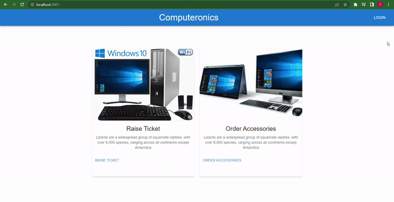

### Computer Repair Tickeeitng System

## Description
This is an full stack application where the user can raise a ticket for any issues with their computer. The users can provide information in the reactive forms to raise a ticket. Only authticated users can login and raise a ticket.

## Features
- Navigating dashboard
- Log in with User Authentication
- Authentication token saved in local storage (localstorage:3000)
- Raising a ticket for repair that can be submitted
- Reactive Form that changes based on the user's option
- Communicating with backend server to save the user info and tokens in database.
- Communicating with backend server to save the tickets a raised by the user.

## User Flow

### User's Local Storage Tokens

### MonngoDB Database Users

### MongoDB Database Tickets

## Technologies
- React (Frontend View Framework)
- TypeScript Language
- React Hooks (useState, useEffect)
- Redux State Managmeet (Redux Thunk)
- SPA (Single Page Application, Routers, Routes)
- MongoDB 
- CSS (styling the app)
- CSS Material UI Library
- Node (npm)
- Visual Studio Code (JavaScript IDE)
- React Testing Library
